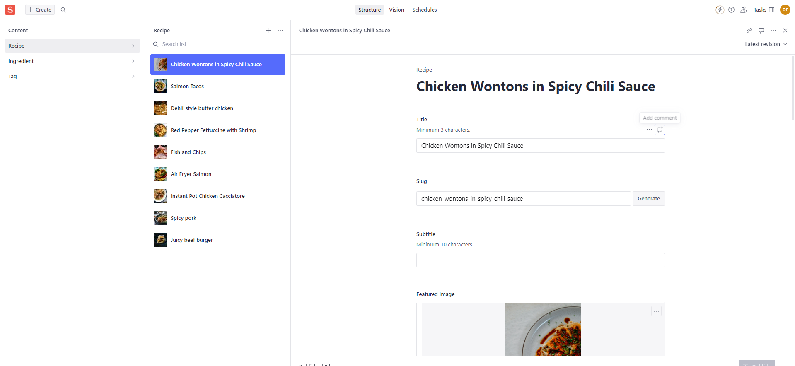

# ReactRecipes

Recipe site created in React using the Next.JS framework

It uses TypeScript and the app router.

<a href="https://react-recipes-sooty.vercel.app/" target="_blank">React Recipes</a>

## Node

It is recommended to use <a href="https://github.com/nvm-sh/nvm" target="_blank">Node Version Manager</a>. See <a href="https://github.com/coreybutler/nvm-windows" target="_blank">here</a> for the Windows version

See the `.nvmrc` file in the project root for the node version to use. At the time of writing it is `20.4.0`. If you use nvm on Linux simply run `nvm use` and it will pick up the version and install it if it's missing. I have not got this to work on macOS (it should), and it is ignored on Windows, so simply run `nvm install {VERSION}` followed by `nvm use {VERSION}`.

## Run locally

Clone the project

`cd recipes`

`npm install`

Note, in order to run the project, create a `.env.local` file in the `recipes` directory. Ask the project owner (me) for the values below

```
NEXT_PUBLIC_SANITY_DATASET=develop
NEXT_PUBLIC_SANITY_PROJECT_ID={PROJECTID}
```

## Sanity Studio

Recipe content is administered through Sanity Studio. Ask project owner (me) to add you to allow you to view/edit/create content

The studio can be accessed by appending `/studio` to the root URL, so for localhost it's `http://localhost:3000/studio`



The schemas for this can be found in `recipes\sanity\schemas`

## Tailwind

The project supports Tailwind CSS, but I have chosen to not use it due to the verboseness of it, instead opting to use named CSS classes in `{Component}.module.css` files, and ultimately I feel this looks a lot cleaner.

## Site search

Site search uses only the recipe name to search on, based on partial matches. This is a limitation, and I will aim to implement Elastic search as this is much faster to search and can search more fields much easier - should the number of published documents grow then search would become increasingly slower on Sanity.

## Further improvements

If you see anything you would like to improve then create a GitHub issue.
